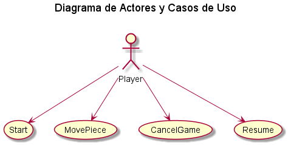
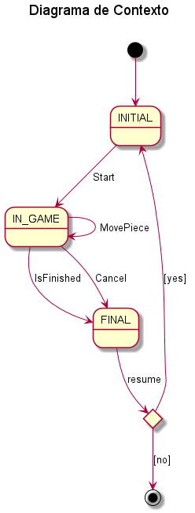
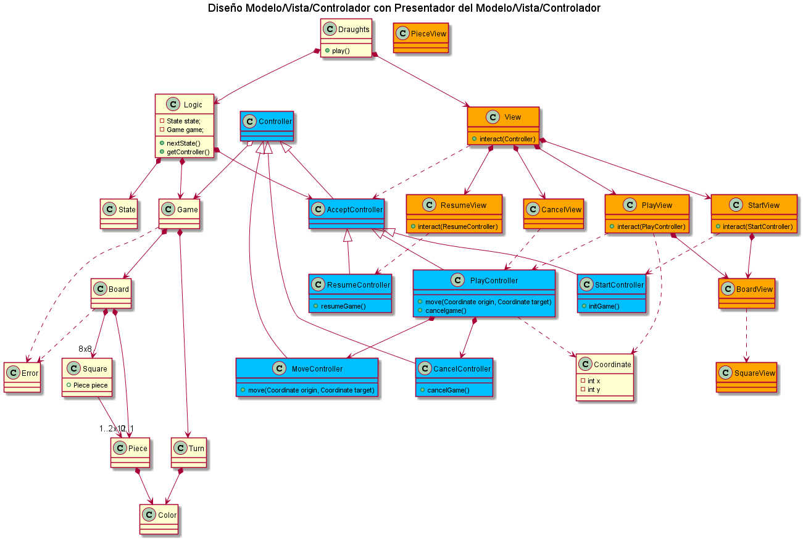

# Práctica Test con el Juego de las Damas. Refactoring

## Damas sin Damas

* Elementos: dos jugadores, un tablero de ajedrez, con una esquina blanca a la derecha de cada jugador, y fichas blancas y negras, para los dos jugadores, 12 peones

* En el estado inicial de la partida se colocan todas los peones de cada jugador en los cuadros negros de las tres filas más cercanas a éste, como en la siguiente imagen.

* Los jugadores mueven alternativamente una de sus fichas, empezando por el jugador de las fichas blancas, de una de las siguientes maneras:

    * un peón de una casilla puede mover a una de las dos casillas adyacentes en diagonal y hacia adelante, si ésta está vacia
    * un peón de una casilla puede mover a una de las dos casillas adyacentes de las adyacentes en diagonal y hacia adelante, si ésta esta vacía y la adyacente está ocupada por un ficha contraria. La ficha contraria "saltada" en este momvimiento se retira del tablero

* Pierde el jugador que no puede realizar movimientos, porque ya no dispone de fichas sobre el tablero

EXTRA:

* Añadida la opción de cancelar la partida con el monado "-1"

***

